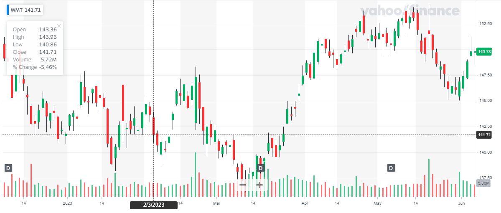
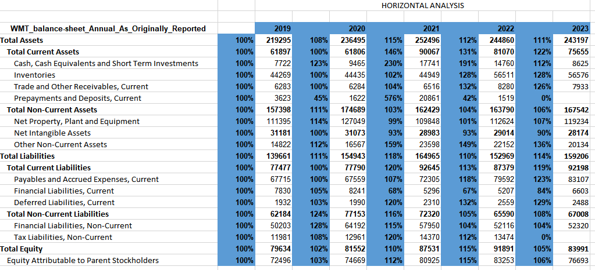
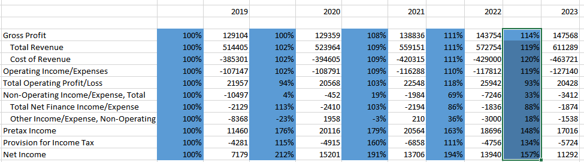
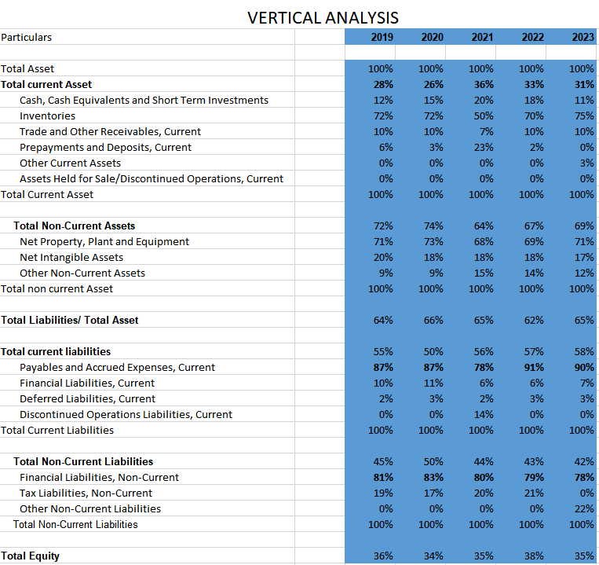
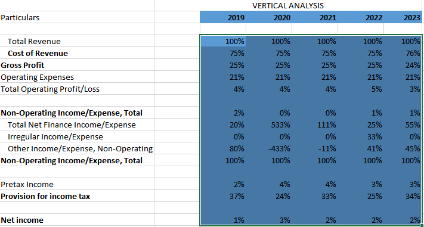
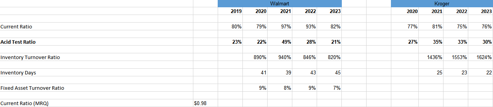
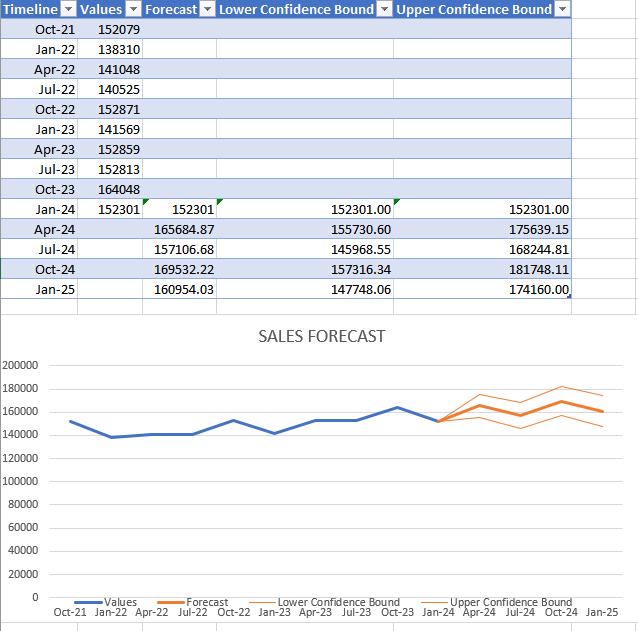
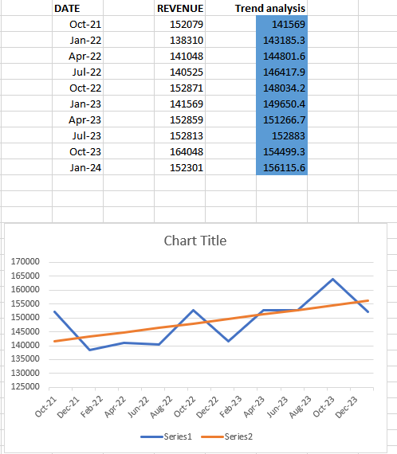

**A Critical Analysis of the Quantitative
Finance and Financial market condition of Walmart**
  
<table border="0" cellpadding="0" cellspacing="0" width="483" style="">
  <thead>
    <tr height="21" style="height: 16pt;">
      <th>Document Name</th>
      <th>Document Description</th>
      <th>Reference Link</th>
    </tr>
  </thead><colgroup><col width="185" style="width: 139pt;"><col width="211" style="width: 158pt;"><col width="87" style="width: 65pt;"></colgroup>
  <tbody>
    <tr height="21" style="height: 16pt;">
      <td height="21" class="xl65" style="padding-top: 1px; padding-right: 1px; padding-left: 1px; color: black; font-size: 12pt; font-family: Calibri, sans-serif; vertical-align: bottom; border-top: none; border-right: 0.5pt solid windowtext; border-bottom: 0.5pt solid windowtext; border-left: 0.5pt solid windowtext; border-image: initial; text-wrap: nowrap; height: 16pt;">QFFM.xlsx</td>
      <td style="padding-top: 1px; padding-right: 1px; padding-left: 1px; color: black; font-size: 12pt; font-family: Calibri, sans-serif; vertical-align: bottom; border: none; text-wrap: nowrap;">
This File has the Critical Analysis of the Quantitative Finance and Financial market condition of Walmart
</td>
      <td class="xl65" style="padding-top: 1px; padding-right: 1px; padding-left: 1px; color: black; font-size: 12pt; font-family: Calibri, sans-serif; vertical-align: bottom; border-top: none; border-right: 0.5pt solid windowtext; border-bottom: 0.5pt solid windowtext; border-left: 0.5pt solid windowtext; border-image: initial; text-wrap: nowrap;"></td>
    </tr>
  </tbody>
</table>
**Introduction:**

Quantitative finance and financial market conditions involves the
application of mathematical and statistical techniques to assess various
aspects of financial markets. It focuses on analysing numerical data,
patterns, and relationships to gain insights into market behaviour, risk
management, investment strategies, and pricing of financial instruments.
These methods help financial institutions and investors estimate
potential losses under different scenarios and make informed risk
management decisions. By analysing historical returns, correlations, and
risk measures, investors can identify efficient portfolios that balance
risk and reward.

By utilizing mathematical and statistical techniques, analysts can gain
a deeper understanding of financial markets, enhance investment
strategies, and make more informed decisions.

**1.1 Walmart:**

Sam Walton created Walmart in 1962 in Bentonville, Arkansas, in the
United States. Walmart built its first shop in Rogers, Arkansas, in
1962, and the company slowly grew throughout the United States during
the 1960s and 1970s.Walmart has a varied retail format portfolio, which
includes Walmart Supercentres, Walmart Budget Stores, Neighbourhood
Markets, & Sam\'s Club warehouses. The corporation operates in several
countries under many classifications, including Asda in the United
Kingdom & Walmart de México y Central America in Mexico and the
Americas.

Walmart is well-known for having a large retail presence. It has over
11,000 shops worldwide and offers clients in over 25 countries. The vast
majority of its outlets are in the USA, where it maintains a significant
market presence. Walmart sells groceries, clothing, electronics, home
decor, health and wellness goods, automotive supplies, and other items.
It sells both national and private-label products.

Walmart has been concentrating on increasing its e-commerce business in
recent years in order to compete with other online merchants such as
Amazon. The firm provides an omnichannel shopping experience through
providing purchasing goods online through its web page and mobile
appalment was actively involved in sustainability initiatives. It
strives to produce zero trash, use renewable energy in its entirety, and
market products that are green. The corporation has set lofty goals
including lowering emissions of greenhouse gases and increasing energy
efficiency. Walmart is one of the world\'s largest private employers,
having a sizable staff. It employs a varied mix of people across its
retail locations, distribution hubs, and corporate headquarters.

In terms of revenue, Walmart routinely ranks amongst the top businesses.
Walmart made over \$560 bn in revenue in its fiscal year 2022. The NY
stock exchange allows for public trading of it under the ticker \"WMT.\"
Through the Walmart Foundation, Walmart has taken part in a number of
charitable endeavours. It focuses on programs for disaster assistance,
environmental sustainability, workforce development, and education*. (
Wahlen, J.M., Baginski, S.P. and Bradshaw, M., 2022)*

**2.1: Financial analysis:**

The practice of analysing the financial statements of a business in
order to judge its performance financially and make wise decisions is
known as financial statement analysis. It entails going over the income
statement, balance sheet, and cash flow statement to get an
understanding of the earnings, liquidity, solvency, and financial
condition in general of the organization.

Take a look at the financial statements: Start by looking at the
company\'s cash flow statement, income statement, and balance sheet.
These financial statements give a quick overview of the company\'s cash
flows, sales, and costs for a certain time period.

For investors, lenders, as well as other stakeholders, to assess the
financial health of a business, identify potential hazards and
possibilities, and arrive at wise judgments, analysis of financial
statements is a critical tool. It aids in predicting a company\'s future
prospects and helps to offer a thorough picture of its financial status.
*(Jiang, Z.Q., Xie, W.J., Zhou, W.X. and Sornette, D., 2019)*

**2.2 Share Trend analysis:**

{width="6.268055555555556in"
height="2.6659722222222224in"}

By the share trend for the past 6 months, we can say the share is
trading in a channel basis, it is trading between 137 to 152 with only
15 dollars change. This shows the company is stable and performing good.

**2.3 Horizontal Analysis:**

A financial statement evaluation approach known as \"horizontal
analysis,\" often referred to as \"trend analysis,\" compares financial
data from multiple time periods to find patterns and variations in a
company\'s performance. The line items of financial statements including
the income statement, the balance sheet, and the cash flow statement are
examined for changes over an extended period of time, usually many
years.

The aim of horizontal analysis is to examine the performance, expansion,
and possible trouble spots of the firm as well as the direction and size
of changes on financial statement components over time.
Comparing previous data, it aids in finding trends, strengths, and
weaknesses. *(Meador, A.L., Church, P.H. and Rayburn, L.G., 1996)*

Financial statement components including revenues, costs, liabilities
and assets, and equity as well as cash flows can all be subject to
horizontal analysis. A company\'s development trajectory, areas of
success or weakness, and the efficacy of the strategies of management
are all possible to be financial data across time.

{width="6.268055555555556in" height="2.85625in"}

{width="6.268055555555556in"
height="1.7486111111111111in"}

From the above horizontal analysis, we can see that all the values have
increased over the course of 5 years, the fixed assets are increased by
6% and current assets by 22%, they are focused on increasing their
current assets, that is a good situation as they can easily liquidate
their assets. We further see their current liabilities and non-current
liabilities are increase by 19% and 8% respectively, they have their
debt management under control with increase in their equity by 5%.

From the horizontal analysis of their income statement, we see their
Total revenue and Net income have increased by 19% and 57% that is a
substantial increase with the increase of cost of goods sold at 19%.

It\'s vital to remember that the financial condition of a business can
frequently not be determined by a horizontal examination alone. To fully
comprehend the business\'s performance and financial status, it should
be combined with vertical evaluation (common-size statements) along with
additional financial analysis approaches.

**2.4 Vertical Analysis:**

A financial statement evaluation approach called vertical analysis,
which is additionally referred to as common-size analysis, involves
presenting each line-item percent of a financial statement in a
percentage on a base amount. Vertical analysis is used to evaluate the
relative significance of each line item on a financial statement as well
as spot patterns and trends in the structure of the statement.

The vertical analysis clarifies the structure and content of financial
statements by emphasizing the varying significance of various line
items. It enables simple comparison between enterprises of varying sizes
as well as within the same organization over time. It also makes it
easier to find the spot patterns, changes, and possible areas of
concern.

{width="5.9183945756780405in"
height="5.574803149606299in"}

{width="5.9921259842519685in"
height="3.2138134295713034in"}

The vertical analysis gives a glimpse of the proportions that exist
inside a single statement of finances yet does not provide details
regarding the business\'s achievements or financial condition in
isolation. To acquire a thorough knowledge of the company\'s entire
financial status, it should be utilized in combination with additional
financial analysis methodologies and measures.

Looking at their vertical analysis we deduce that in their total current
assets, cash constitute about 31% and inventories by 11%. PPE and net
tangible assets constitute 71% and 17% of the total noncurrent assets.

With the vertical analysis of the income statement, we can see they are
spending 76% of their total revenue on cost of goods sold but making
only 2% in net income.

**3.1 Self-Test:**

Walmart Inc. is a New York Stock Exchange (NYSE)-listed publicly traded
business. As a result, Walmart is a stock market participant,
specifically the NYSE. It constitutes one of the biggest and most
well-known firms on the NYSE, and its ticker symbol is \"WMT.\"
Investors of all kinds can buy and sell Walmart shares on the NYSE as a
publicly listed business.

Here by looking our previous data of horizontal and vertical analysis we
can arrive at conclusion that they spend more on their cost of goods
sold with only 2% increase in their net revenue but we see they have
reduced their long-term liabilities and increased their liquifiable
assets substantially, we can say they have been better at their debt and
asset management.

**4.1 Current ratio:**

The capacity of a corporation to pay off its short-term creditors with
its short-term wealth is gauged by the current ratio, a financial
statistic. It gives information on the firm\'s liquidity and capacity to
fulfil its immediate commitments.

> Current Ratio= $\frac{Current\ Asset}{Current\ Liability}$

Their current ratio of Walmart is 82% and that of their competitor
Kroger is 76%, as their ratios are below 1, we can conclude that they
have lower liquidity to pay off any short-term assets.

Current ratio \< 1: The company\'s current assets are greater than its
current liabilities. A ratio above one shows the business has more
assets than liabilities to cover current obligations.

Current Ratio = 1: The firm\'s current obligations and assets are equal.
Although this could be deemed enough, it leaves little space for
unforeseen changes or potential financial issues.

Current Ratio \> 1: Current liabilities \> Current assets for the firm.
This can be a sign of potential cash problems and challenges in meeting
immediate obligations. *(Barnes, P., 1987.)*

**4.2 Acid- test ratio:**

The liquidity ratio, commonly referred to as the fast ratio or the
acid-test ratio, is a financial statistic that assesses a company\'s
capacity to settle its most liquid obligations first. In comparison with
the current ratio, it offers a stricter evaluation of liquidity because
inventory is not factored into the computation.

> Acid Test Ratio=
> $\frac{Current\ Asset - Inventory}{Current\ Liability}$

Their Acid test ratio of Walmart is 21% and that of their competitor
Kroger is 30%, as their ratios are below 1, we can conclude that most of
their current assets are dependent on their inventories.

Acid-Test Ratio \> 1: The corporation has enough liquid assets
(excluding inventory) to cover its current liabilities if the acid-test
ratio is greater than 1. A ratio greater than one is considered good
since it shows the business has sufficient easily accessible assets to
cover its immediate commitments without primarily depending on inventory
sales.

Acid-Test Ratio = 1: The company\'s current liabilities are equal to its
liquid assets (excluding inventory). Although this could be deemed
enough, it leaves little space for unforeseen changes or potential
financial issues.

Acid-Test Ratio \< 1: The company\'s financial resources (excluding
inventory) were insufficient to meet its current liabilities (Acid-Test
Ratio 1). This might point to potential cash problems and difficulties
satisfying short-term obligations.

**4.3 Inventory turnover ratio:**

The inventory turnover ratio is a financial statistic that calculates
the number of times a firm sells and replaces its inventory over a
certain period to determine how effectively it manages its inventory. It
can give insights into handling inventory and sales success by assessing
how quickly a product is sold and replaced.

> Inventory Turnover Ratio= $\frac{COGS}{Average\ Inventories}$

The Inventory Turnover ratio of Walmart is 820% and that of their
competitor Kroger is 1624%, this shows that Kroger has better inventory
management with lower number of inventory days and higher inventory
turnover.

High Inventory Turnover Ratio: A large percentage in comparison to
industry peers or previous performance is usually seen as a favourable
indicator. It implies that the firm is selling and refilling inventory
successfully, minimizing storage expenses and the danger of outdated
inventory.

Low Inventory Turnover Ratio: When compared to industry peers or
previous performance, a low ratio may suggest slower revenue, excess
inventory, or ineffective inventory management. It could point to
struggles such as dated goods, inadequate demand forecasts, or
inefficient marketing techniques.

**4.4 Fixed Asset turnover ratio:**

The fixed asset turnover ratio represents a financial measurement that
assesses how well a firm uses its fixed assets to produce sales revenue.
It reflects the company\'s potential to produce revenue from its assets
in real estate, plant, and equipment.

> Fixed Asset Turnover Ratio=
> $\frac{Net\ Income}{Average\ Fixed\ Asset}$

With the fixed asset turnover ratio calculation of Walmart, we can see
that they are making 7% return from their total fixed assets.

High Fixed Asset Turnover Ratio: A high fixed asset turnover ratio in
comparison to industry peers or previous performance is often seen as
beneficial. It shows that the organization is making good use of its
fixed assets to produce sales income. This might be the consequence of
better asset management, improved operations, or increased production
capacity.

Low Fixed Asset Turnover Ratio: When compared to industry peers or
previous performance, a low ratio could indicate insufficient use of
fixed assets or inefficiency in producing revenue. It might indicate
surplus capacity, low demand, and operational inefficiencies.
*(Lewellen, J., 2004)*

{width="6.266848206474191in"
height="2.7567563429571305in"}

**5.1 DCF:**

DCF is an abbreviation for Discounted Cash Flow, a financial valuation
approach used to assess the true worth of a stock, business, or asset.
By discounting anticipated future earnings to their present value, the
DCF analysis accounts for the present-day value of money.

**5.2 Terminal Value:**

It is used to determine the future value of an investment. It takes the
future free cash flow of the firm and discounts it the present value.

TV= $\frac{FCF*(1 + growth\ rate)}{(WACC - growth\ rate)}$

TV= 538895.1

I have used excel to calculate the Terminal value and I have attached
the excel copy for your reference.

**5.3 Enterprise Value:**

It is the total value of the company for the estimated period.

EV = Sum of present FCF of forecasted period + Terminal value

EV = 420156

I have used excel to calculate the Enterprise value and I have attached
the excel copy for your reference.

**5.4 Implied share value:**

It is the estimated share price of the company if it is performing to
our assumptions. This value is used to estimate whether the share is
trading in a discounted value or is it over valued.

Implied value = $\frac{EV + Cash - Debt}{Outstanding\ shares}$

Implied Value = 141

From DCF calculation we can determine the share is not over valued or
undervalued, it is trading at a nominal price.

DCF analysis is commonly utilized for valuation reasons in investment
and financial analysis. It enables analysts and investors to evaluate an
investment\'s fair value based on predicted cash flows plus the needed
rate of return. It is crucial to remember, however, that DCF analysis
entails making assumptions and predictions, which might increase
uncertainty and impair the valuation\'s accuracy. It is frequently used
together with other valuation techniques and should be evaluated in the
framework of a thorough examination.

**6.1 WACC:**

WACC is an abbreviation for the Weighted Average Cost of Capital. It\'s
a financial measure that shows the mean amount of return on investments
required by a firm to meet the needs of its investors, who include
equity as well as debt holders. The WACC calculation considers a
company\'s capital structure\'s percentage of debt and equity, as well
as the expenses related to each source of capital.

**6.2 BETA Calculation:**

BETA measures the volatility and the systematic risk in accrued with the
security or a portfolio comparing with the market as whole.

β =$\frac{Covariance(ri,rm)}{variance(rm)}$

β = 0.78546

I have used excel to calculate the BETA value and I have attached the
excel copy for your reference.

**6.3 WACC Calculation:**

WACC = (% Equity\* Cost of equity) + (% Debt\*cost of debt\*(1-Tax
rate))

Cost of Equity = Risk free rate+ (Beta\* market risk premium)

Cost of Equity = 3.61+(0.78\*5.94)

=8.24%

Cost of Debt = Interest Expense/Total Debt

= 1874/58923

= 3%

WACC = (87% \* 8.24%) + (13% \* 3% \* (1-24%))

WACC = 7.50%

I have used excel to calculate the WACC value and I have attached the
excel copy for your reference.

The WACC calculates the discount rate to be utilized in the DCF
(discounted cash flow) analysis and aids in the evaluation of investment
possibilities. It indicates the average cost of capital for the firm and
is frequently used as a criterion for investment decisions.

The WACC considers the proportional importance of every source of
funding in the company\'s structure of capital, representing debt as
well as equity investors\' risk and return expectations. The cost of
stock and cost of debt indicates the needed rates of return depending on
the source, taking into account factors like market circumstances,
risk-free costs, and the risk profile of the organization.

It should be noted the WACC represents an estimate and could
underestimate the company\'s real cost of capital. The assumptions
employed in the computation, such as the price of equity and the cost of
debt, might vary and affect the resultant WACC. When utilizing the WACC
in the analysis and decision-making processes, it is critical to employ
solid judgment, includes realistic inputs, and analyse the company\'s
individual circumstances.

**7.1 Sales Forecast:**

A sales forecast represents an estimate of the future revenue from sales
that a firm intends to achieve over a certain time period. It is an
essential component of financial planning because it enables
organizations to make educated decisions about production, inventories,
allocation of resources, and the overall strategy of the company*.
(West, D.C., 1994)*

{width="6.268055555555556in"
height="6.199305555555555in"}

By analysing their sales data of two years from October 2021 to January
2023, above (Fig) is their sales forecast, with an optimistic approach,
we can say their revenue can go up to 17,4160 by January 2025. In a
conservative case, it can go up to 16,954 in the same period.\
In base case, it can go up to 14,77,48 by January 2025.

**7.2 Trend Analysis:**

Trend analysis, commonly referred to as time-series analysis, and a
statistical approach to discovering trends and patterns in data across
time. It entails inspecting and evaluating historical data points to
detect regular patterns, directions, and sizes of change.

{width="5.1882239720035in"
height="5.93832895888014in"}

In trend analysis for last two years, we can conclude that they have a
steady increase in sales which is optimistic for their forecast.

Trend analysis aids in the identification of historical trends and
serves as a foundation for forecasting & decision-making. It helps
analysts to comprehend the scale and direction of change, analyse the
influence of previous events or behaviours, and make educated
predictions about future trends.

**8. References:**

-   Jiang, Z.Q., Xie, W.J., Zhou, W.X. and Sornette, D., 2019.
    Multifractal analysis of financial markets: a review. *Reports on
    Progress in Physics*, *82*(12), p.125901.

-   Meador, A.L., Church, P.H. and Rayburn, L.G., 1996. Development of
    prediction models for horizontal and vertical mergers. *Journal of
    financial and strategic decisions*, *9*(1), pp.11-23.

-   Barnes, P., 1987. The analysis and use of financial ratios. *Journal
    of Business Finance dan Accounting*, *14*(4), p.449

-   Lewellen, J., 2004. Predicting returns with financial
    ratios. *Journal of Financial Economics*, *74*(2), pp.209-235.

-   West, D.C., 1994. Number of sales forecast methods and marketing
    management. *Journal of Forecasting*, *13*(4), p.395.

-   Wahlen, J.M., Baginski, S.P. and Bradshaw, M., 2022. *Financial
    reporting, financial statement analysis and valuation*. Cengage
    learning.
